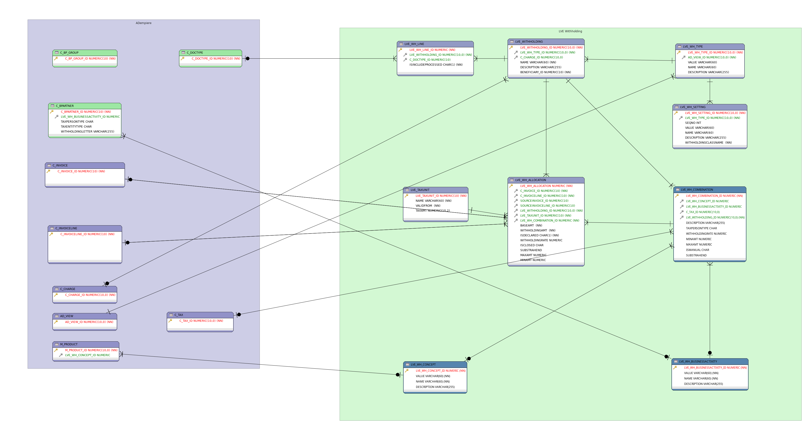

# Localización de ADempiere para Venezuela

Esta localización permite lo siguiente:
  - Generar Retenciones a proveedores:
    - I.V.A.
    - I.S.L.R.
    - Municipal
  - Declarar Retenciones:
    - XML de I.S.L.R.
    - TXT de I.V.A.
    - TXT de Retenciones Municipales.
    
  - Generar IGTF de manera automática.
  - Calcular el Descuento de impuesto según decreto de descuento de impuesto a cliente
  - Imprimir con Impresora fiscal: Soportado para las impresoras The Factory HKA
  - Validar el R.I.F ante el SENIAT
  - Generar el Número de Control para documentos de CxP
  - Cargar Número de Control para documentos de CxC
  - Generar Pagos en lote para los bancos:
    - Bancaribe
    - Banesco
    - Banplus
    - BFC
    - BOD
    - Exterior
    - Mercantil
    - Provincial
    - Venezuela
  - Generar Archivos de inscripción de Nómina para:
    - Provincial
  - Cargar Extracto Bancario de los bancos:
    - Bancaribe
    - Banesco
    - Banplus
    - BFC
    - Mercantil
    - Provincial
    - Venezuela
    - BNC
    - Banco del Tesoro
  - Generar Archivos para pago en lote de Nómina para los bancos:
    - Bancaribe
    - Banesco
    - Mercantil
    - Provincial
    - Sofitasa
    - Banplus
    - Sofitasa
  - Generar Archivos de inscripción de Nómina para:
    - Provincial
  - Generar Archivos para declaración de:
    - Minpptrass
    - Banavih
    - Tiuna
  - Generar Archivos de exportación para los proveedores de alimentación:
    - Todoticket
    - Sodexo
  - Generar Archivos de Inscripción en Todoticket

## Antes de Instalar

Para poder configurar e instalar la localización se requiere:
  - Razón social y RIF para tu compañía

## Instalación de la localización

- Descarga e instala la ultima versión de ADempiere (https://github.com/adempiere/adempiere/releases)
- Descargar la localización usando git clone https://github.com/adempiere/LVE.git
- Establece la propiedad adempiere.home editando el archivo build.properties
- Ejecuta el comando ant install
- Importar y aplicar el script LVE.xml con la definición del diccionario de aplicaciones
    - Application Dictionary -> Import migration from XML [File Name: LVE/xml/LVE.xml]
    - Application Dictionary -> Migration , busca el script LVE y aplica en tu instalación
- Crear la configuración requerida para tu compañía en ADempiere

## Configuración de la localización

## Licencia
Copyright (C) 2003-2018 E.R.P. Consultores y Asociados, C.A. All Rights Reserved.
Código disponible con licencia GNU/GPLv3.

## Contacto
 - Yamel Senih ysenih@erpya.com E.R.P. Consultores y Asociados, C.A.
 - Carlos Parada cparada@erpya.com E.R.P. Consultores y Asociados, C.A.
