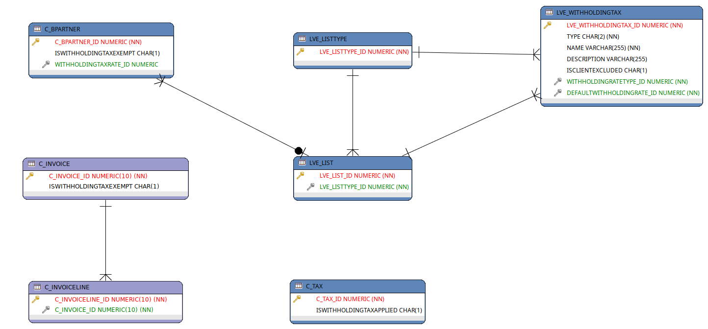
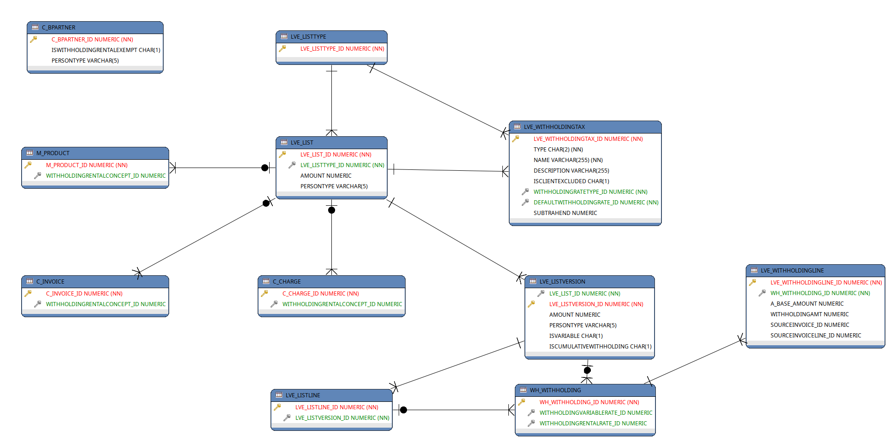
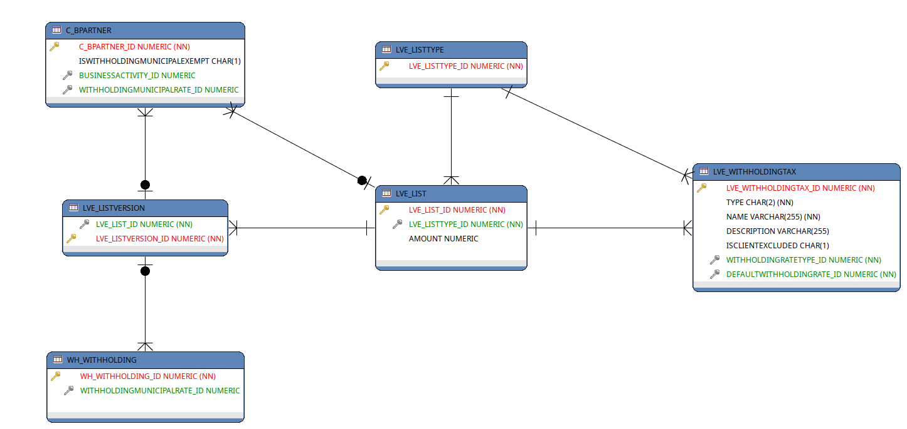

# Localización de ADempiere para Venezuela

Esta localización permite lo siguiente:
  - Generar Retenciones a proveedores:
   - I.V.A. [Con base en Gaceta Oficial 40720 (SNAT/2015/0049)](http://declaraciones.seniat.gob.ve/portal/page/portal/MANEJADOR_CONTENIDO_SENIAT/01NOTICIAS/00IMAGENES/GACETAOFICIAL40720.pdf)
   - I.S.L.R. [Con base a manual técnico de Sistema de Impuesto Sobre la Renta](http://declaraciones.seniat.gob.ve/portal/page/portal/MANEJADOR_CONTENIDO_SENIAT/05MENU_HORIZONTAL/5.3ANUNCIOS_CARTELES/5.3.2CARTELES_NOTIFICACION/CARTELES/MT_Retenciones%20ISLRV3.0_2014.pdf)
   - Municipal
  - Declarar Retenciones:
    - TXT de I.V.A.
    - XML de I.S.L.R.
    - TXT de Retenciones Municipales.
  - Generar IGTF de manera automática.
  - Calcular el Descuento de impuesto según decreto de descuento de impuesto a cliente
  - Imprimir con Impresora fiscal: Soportado para las impresoras The Factory HKA
  - Validar el R.I.F ante el SENIAT
  - Generar el Número de Control para documentos de CxP
  - Cargar Número de Control para documentos de CxC
  - Generar Pagos en lote para los bancos:
    - Bancaribe
    - Banesco
    - Banplus
    - BFC
    - BOD
    - Exterior
    - Mercantil
    - Provincial
    - Venezuela
  - Generar Archivos de inscripción de Nómina para:
    - Provincial
  - Cargar Extracto Bancario de los bancos:
    - Bancaribe
    - Banesco
    - Banplus
    - BFC
    - Mercantil
    - Provincial
    - Venezuela
    - BNC
    - Banco del Tesoro
  - Generar Archivos para pago en lote de Nómina para los bancos:
    - Bancaribe
    - Banesco
    - Mercantil
    - Provincial
    - Sofitasa
    - Banplus
    - Sofitasa
  - Generar Archivos de inscripción de Nómina para:
    - Provincial
  - Generar Archivos para declaración de:
    - Minpptrass
    - Banavih
    - Tiuna
  - Generar Archivos de exportación para los proveedores de alimentación:
    - Todoticket
    - Sodexo
  - Generar Archivos de Inscripción en Todoticket

## Antes de Instalar

Para poder configurar e instalar la localización se requiere:
  - Razón social y RIF para tu compañía

## Instalación de la localización

- Descarga e instala la ultima versión de ADempiere (https://github.com/adempiere/adempiere/releases)
- Descarga e instala la ultima versión de la Localización Venezuela (https://github.com/adempiere/LVE/releases)
- Descomprime el archivo LVE.zip: Al descomprimir el archivo quedará una estructura de la siguiente manera:
  - LVE.jar: Este archivo contiene lo necesario para que funcione la localización
  - translation: Directorio con la traducción VE y origen MX
  - migration: Directorio con los XML que se deben aplicar para tener la localización instalada
- En la instalación de ADempiere, dentro del directorio packages cree una estructura de directorio **LVE/lib**
- Mueva el archivo LVE.jar al directorio previamente creado $ADEMPIERE_HOME/packages/LVE/lib
- Ejecute el comando RUN_silentsetup.sh / bat según sea su sistema operativo
- Importe los XML's que se encuentran en el directorio **migration** descomprimido previamentes- Reinicie el servicio de ADempiere
- Listo!!

## Configuración de la localización

Diagrama E-R para I.V.A.

Diagrama E-R para I.S.L.R.

Diagrama E-R para Municipal.

	

## Licencia
Copyright (C) 2003-2018 E.R.P. Consultores y Asociados, C.A. All Rights Reserved.
Código disponible con licencia GNU/GPLv2 or later.

## Contacto
 - Yamel Senih ysenih@erpya.com E.R.P. Consultores y Asociados, C.A.
 - Carlos Parada cparada@erpya.com E.R.P. Consultores y Asociados, C.A.
